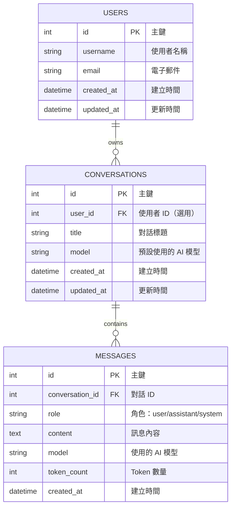

## 專案名稱
    PilotX

## 核心功能 (Core Features)
1. 多模型整合：支援接入不同 AI 模型 (如 OpenAI GPT、Anthropic Claude、Llama 等)，使用者可選擇或自動切換。
2. 對話介面：提供即時問答，支援文字、Markdown、程式碼高亮顯示。
3. 模式切換：例如「快速回答」、「深入推理」、「學習模式」等，讓使用者依需求選擇。
4. 上下文管理：保留對話歷史，支援個人化設定 (語言、主題、偏好)。
5. 擴充插件：可接入外部 API (查天氣、查股票、搜尋文件)，形成「智慧工具箱」。
6. 安全與合規：提供 API Key 驗證、使用者資料保護、日誌追蹤。

## 目標用戶 (Target Users)
1. 工程師 / 開發者：需要程式碼輔助、技術解答、文件生成。
2. 知識工作者：需要快速查詢、摘要、文件草稿。
3. 學生 / 學習者：需要互動式學習、考題練習、知識解釋。
4. 企業團隊：需要內部知識庫整合、協作工具、客製化 AI 助理。

## 階段開發
1. 先用 React + Tailwind 做一個簡單的 Chat UI
2. 後端用 FastAPI，只做一個 /chat API
3. 接上 OpenAI API (或其他的 LLM)
4. 把回覆顯示在前端，支援 Markdown + 程式碼高亮
5. 再慢慢加上歷史紀錄、模式切換、語音/圖片等功能

## 快速開始指南

### 前置需求

- Node.js 18+
- Python 3.10+
- Git
- VS Code (推薦)
- **Ollama** (本地 AI 模型運行環境)
- 建議硬體：16GB+ RAM, GPU (可選但建議)

### 專案初始化

#### 0. 安裝 Ollama (重要！)

```bash
# 安裝 Ollama
winget install Ollama.Ollama

# 重新載入環境變數
$env:Path = [System.Environment]::GetEnvironmentVariable("Path","Machine") + ";" + [System.Environment]::GetEnvironmentVariable("Path","User")

# 驗證安裝
ollama --version

# 下載 Llama 3.1 (8B) 模型
ollama pull llama3.1:8b

# 驗證模型
ollama list

# 測試模型
$body = @{model="llama3.1:8b"; prompt="Hello"; stream=$false} | ConvertTo-Json
Invoke-RestMethod -Uri "http://localhost:11434/api/generate" -Method Post -Body $body -ContentType "application/json"
```

#### 1. 建立專案結構

```bash
# 建立專案根目錄
mkdir PilotX
cd PilotX

# 初始化 Git
git init
git checkout -b develop

# 建立基本目錄
mkdir frontend backend

# 建立環境變數範本
touch .env.example
touch .gitignore
```

#### 2. 前端設置

```bash
# 進入前端目錄
cd frontend

# 使用 Vite 建立 React + TypeScript 專案
npm create vite@latest . -- --template react-ts

# 安裝依賴
npm install

# 安裝 Tailwind CSS
npm install -D tailwindcss postcss autoprefixer
npx tailwindcss init -p

# 安裝專案依賴
npm install axios react-markdown remark-gfm react-syntax-highlighter zustand lucide-react

# 安裝開發依賴
npm install -D @types/react-syntax-highlighter vitest @testing-library/react

# 建立目錄結構
mkdir -p src/components src/pages src/services src/hooks src/context src/types

# 建立環境變數檔案
echo "VITE_API_BASE_URL=http://localhost:8000/api/v1" > .env
```

**tailwind.config.js**
```javascript
/** @type {import('tailwindcss').Config} */
export default {
  content: [
    "./index.html",
    "./src/**/*.{js,ts,jsx,tsx}",
  ],
  theme: {
    extend: {},
  },
  plugins: [],
}
```

**src/index.css**
```css
@tailwind base;
@tailwind components;
@tailwind utilities;
```

#### 3. 後端設置

```bash
# 進入後端目錄
cd ../backend

# 建立虛擬環境
python -m venv venv

# 啟動虛擬環境 (Windows)
.\venv\Scripts\activate
# 啟動虛擬環境 (Linux/Mac)
# source venv/bin/activate

# 建立目錄結構
mkdir -p app/core app/db app/models app/schemas app/repositories app/services app/api/endpoints

# 建立 __init__.py 檔案
New-Item -ItemType File -Path app/__init__.py
New-Item -ItemType File -Path app/core/__init__.py
New-Item -ItemType File -Path app/db/__init__.py
New-Item -ItemType File -Path app/models/__init__.py
New-Item -ItemType File -Path app/schemas/__init__.py
New-Item -ItemType File -Path app/repositories/__init__.py
New-Item -ItemType File -Path app/services/__init__.py
New-Item -ItemType File -Path app/api/__init__.py
New-Item -ItemType File -Path app/api/endpoints/__init__.py

# 建立 requirements.txt
@"
fastapi==0.108.0
uvicorn[standard]==0.25.0
sqlalchemy==2.0.23
alembic==1.13.0
openai==1.6.0
pydantic==2.5.0
pydantic-settings==2.1.0
python-dotenv==1.0.0
python-jose[cryptography]==3.3.0
slowapi==0.1.9
httpx==0.25.2
pytest==7.4.3
pytest-asyncio==0.21.1
loguru==0.7.2
"@ | Out-File -FilePath requirements.txt -Encoding utf8

# 安裝依賴
pip install -r requirements.txt

# 建立環境變數檔案
@"
APP_NAME=PilotX
APP_ENV=development
DEBUG=True
SECRET_KEY=your-secret-key-change-in-production

HOST=0.0.0.0
PORT=8000

DATABASE_URL=sqlite:///./pilotx.db

CORS_ORIGINS=http://localhost:5173,http://localhost:3000

# AI 提供者設定 (使用 Ollama)
AI_PROVIDER=ollama
OLLAMA_BASE_URL=http://localhost:11434
DEFAULT_MODEL=llama3.1:8b
OLLAMA_TIMEOUT=60

MAX_TOKENS=2000
TEMPERATURE=0.7

# 雲端 AI Keys (階段二再使用)
# OPENAI_API_KEY=your-key-here
# ANTHROPIC_API_KEY=your-key-here
# GOOGLE_API_KEY=your-key-here

RATE_LIMIT_PER_MINUTE=20
LOG_LEVEL=INFO
"@ | Out-File -FilePath .env -Encoding utf8
```

#### 4. 啟動開發環境

**終端機 1 - 後端**
```bash
cd backend
.\venv\Scripts\activate  # Windows
uvicorn main:app --reload --port 8000
```

**終端機 2 - 前端**
```bash
cd frontend
npm run dev
```

訪問 http://localhost:5173 開始開發！

### 初始化資料庫

```bash
cd backend

# 初始化 Alembic
alembic init alembic

# 編輯 alembic.ini，設定 sqlalchemy.url
# sqlalchemy.url = sqlite:///./pilotx.db

# 建立初始遷移
alembic revision --autogenerate -m "Initial migration"

# 執行遷移
alembic upgrade head
```

## 差異化特色 (Differentiators)
1. 多模型平台：不像單一模型的助理，能根據任務自動選擇最合適的 AI。
2. 模組化架構：前端、後端、AI 層分離，方便替換模型或擴充功能。
3. 可客製化 Prompt Engine：支援不同場景的提示詞模板 (學習、程式碼、商務)。
4. 雙語/多語支援：針對亞洲市場 (例如中文/英文切換)，提升使用者體驗。
5. 插件生態：允許第三方開發者擴充功能，形成工具市場。
6. 透明度與合規：提供模型來源、版本資訊，符合企業合規需求

## 架構藍圖

1. 前端 (UI/UX)
    框架選擇
        React + TypeScript
        Tailwind CSS / Chakra UI

2. 後端 (API Gateway)
    框架選擇
        FastAPI
        SQAlchemy

3. AI 模型整合
    階段一 (本地開發)
        - Ollama + Llama 3.1 (8B) - 主要開發測試模型
        - 完全免費、GPU 加速、隱私安全
    
    階段二 (進階功能)
        - 支援多模型切換
        - OpenAI GPT-3.5-Turbo、GPT-4
        - Google Gemini Pro
        - Anthropic Claude
    
    技術架構
        - 統一 AI Service 介面
        - 支援提供者熱切換
        - 本地 Ollama API (http://localhost:11434)

4. 資料層
    SQLite

## 系統架構 僅供參考, 這是借用其他專案的.
- 請參照底下的分層架構, 建構 frontend, backend 目錄與分工.
- 請依照本專案的需求, 新增檔案, 改名.

1. 前端
frontend/
├── src/
│   ├── components/              # 可複用 UI 組件
│   │   ├── ChatInput.jsx       # 聊天輸入框組件
│   │   ├── MessageList.jsx     # 訊息列表組件
│   │   ├── MessageItem.jsx     # 單則訊息組件
│   │   ├── CodeBlock.jsx       # 程式碼區塊組件
│   │   ├── ChatHistory.jsx     # 歷史對話列表
│   │   └── ModelSelector.jsx   # AI 模型選擇器
│   ├── pages/                   # 頁面級組件
│   │   └── ChatPage.jsx        # 聊天主頁面
│   ├── services/                # API 服務層
│   │   ├── api.js              # Axios 實例配置
│   │   └── chatService.js      # Chat API 服務
│   ├── hooks/                   # 自定義 Hooks
│   │   └── useAsync.js         # 異步操作 Hook
│   ├── context/                 # React Context 狀態管理
│   │   ├── ChatContext.jsx     # Chat 全局狀態
│   │   └── ModelContext.jsx    # AI 模型狀態
│   ├── App.jsx                  # 應用主組件
│   ├── main.jsx                 # 應用入口
│   └── index.css                # 全局樣式
├── index.html                   # HTML 模板
├── package.json                 # 依賴管理
├── vite.config.js               # Vite 配置
├── tailwind.config.js           # Tailwind 配置
├── postcss.config.js            # PostCSS 配置
└── .env                         # 環境變量

2. 後端
backend/
├── app/
│   ├── __init__.py
│   ├── core/
│   │   ├── __init__.py
│   │   └── config.py              # 配置管理（環境變量、應用設置）
│   ├── db/
│   │   ├── __init__.py
│   │   └── database.py            # 數據庫連接、SessionLocal、get_db()
│   ├── models/
│   │   ├── __init__.py
│   │   ├── conversation.py        # 對話 ORM 模型
│   │   ├── message.py             # 訊息 ORM 模型
│   │   └── user.py                # 用戶 ORM 模型（選用）
│   ├── schemas/
│   │   ├── __init__.py
│   │   ├── chat.py                # Chat 請求/回應模型
│   │   └── conversation.py        # Conversation 驗證模型
│   ├── repositories/
│   │   ├── __init__.py
│   │   ├── conversation_repository.py  # 對話數據層
│   │   └── message_repository.py       # 訊息數據層
│   ├── services/
│   │   ├── __init__.py
│   │   ├── chat_service.py        # 聊天業務邏輯
│   │   └── ai_service.py          # AI 模型整合服務
│   └── api/
│       ├── __init__.py
│       └── endpoints/
│           ├── __init__.py
│           ├── chat.py            # Chat API 路由
│           └── conversation.py    # Conversation API 路由
├── main.py                         # FastAPI 應用入口
├── requirements.txt                # Python 依賴
├── .env                            # 環境變量
└── .gitignore

## 資料庫設計

### ER Diagram (Mermaid)



### Tables Schema

```sql
-- 使用者表（選用，階段1可省略）
CREATE TABLE users (
    id INTEGER PRIMARY KEY AUTOINCREMENT,
    username VARCHAR(50) UNIQUE NOT NULL,
    email VARCHAR(100) UNIQUE,
    created_at TIMESTAMP DEFAULT CURRENT_TIMESTAMP,
    updated_at TIMESTAMP DEFAULT CURRENT_TIMESTAMP
);

-- 對話表
CREATE TABLE conversations (
    id INTEGER PRIMARY KEY AUTOINCREMENT,
    user_id INTEGER,  -- 階段1可為 NULL
    title VARCHAR(200) DEFAULT 'New Conversation',
    model VARCHAR(50) DEFAULT 'gpt-3.5-turbo',
    created_at TIMESTAMP DEFAULT CURRENT_TIMESTAMP,
    updated_at TIMESTAMP DEFAULT CURRENT_TIMESTAMP,
    FOREIGN KEY (user_id) REFERENCES users(id) ON DELETE CASCADE
);

-- 訊息表
CREATE TABLE messages (
    id INTEGER PRIMARY KEY AUTOINCREMENT,
    conversation_id INTEGER NOT NULL,
    role VARCHAR(20) CHECK(role IN ('user', 'assistant', 'system')) NOT NULL,
    content TEXT NOT NULL,
    model VARCHAR(50),
    token_count INTEGER DEFAULT 0,
    created_at TIMESTAMP DEFAULT CURRENT_TIMESTAMP,
    FOREIGN KEY (conversation_id) REFERENCES conversations(id) ON DELETE CASCADE
);

-- 索引優化
CREATE INDEX idx_messages_conversation_id ON messages(conversation_id);
CREATE INDEX idx_conversations_user_id ON conversations(user_id);
CREATE INDEX idx_messages_created_at ON messages(created_at);
```

### 資料表關係說明

1. **USERS** (選用)
   - 一個使用者可以擁有多個對話
   - 階段1開發可省略，直接使用匿名對話

2. **CONVERSATIONS**
   - 儲存對話的元資料
   - 與 MESSAGES 為一對多關係

3. **MESSAGES**
   - 儲存實際的對話訊息
   - 每則訊息屬於一個對話
   - role 欄位區分使用者/助手/系統訊息

### DBML (用於 dbdiagram.io)

```dbml
// PilotX Database Schema
// 複製此內容到 https://dbdiagram.io/ 生成互動式 ER Diagram

Project PilotX {
  database_type: 'SQLite'
  Note: 'AI 聊天助手資料庫設計'
}

Table users {
  id integer [primary key, increment, note: '主鍵']
  username varchar(50) [unique, not null, note: '使用者名稱']
  email varchar(100) [unique, note: '電子郵件']
  created_at timestamp [default: `CURRENT_TIMESTAMP`, note: '建立時間']
  updated_at timestamp [default: `CURRENT_TIMESTAMP`, note: '更新時間']
  
  Note: '使用者表（階段1可選用）'
}

Table conversations {
  id integer [primary key, increment, note: '主鍵']
  user_id integer [null, note: '使用者 ID（選用）']
  title varchar(200) [default: 'New Conversation', note: '對話標題']
  model varchar(50) [default: 'gpt-3.5-turbo', note: '預設 AI 模型']
  created_at timestamp [default: `CURRENT_TIMESTAMP`, note: '建立時間']
  updated_at timestamp [default: `CURRENT_TIMESTAMP`, note: '更新時間']
  
  indexes {
    user_id
    created_at
  }
  
  Note: '對話主表，儲存對話元資料'
}

Table messages {
  id integer [primary key, increment, note: '主鍵']
  conversation_id integer [not null, note: '對話 ID']
  role varchar(20) [not null, note: 'user/assistant/system']
  content text [not null, note: '訊息內容']
  model varchar(50) [note: '使用的 AI 模型']
  token_count integer [default: 0, note: 'Token 數量']
  created_at timestamp [default: `CURRENT_TIMESTAMP`, note: '建立時間']
  
  indexes {
    conversation_id
    created_at
  }
  
  Note: '訊息表，儲存對話的每則訊息'
}

// 關聯關係
Ref: conversations.user_id > users.id [delete: cascade]
Ref: messages.conversation_id > conversations.id [delete: cascade]
```

**使用方式：**
1. 複製上方 DBML 代碼
2. 前往 https://dbdiagram.io/
3. 貼上代碼
4. 即可生成互動式 ER Diagram
5. 可匯出為 PNG、PDF 或 SQL

## API 端點設計

### RESTful API 規格

#### 1. 聊天相關

**POST /api/v1/chat**
- 描述：發送訊息並獲取 AI 回應
- 請求體：
```json
{
  "conversation_id": 1,  // 可選，null 則建立新對話
  "message": "你好，請幫我解釋什麼是 FastAPI",
  "model": "gpt-3.5-turbo"  // 可選，預設使用系統設定
}
```
- 回應：
```json
{
  "conversation_id": 1,
  "message": {
    "id": 123,
    "role": "assistant",
    "content": "FastAPI 是一個現代、快速的 Python Web 框架...",
    "model": "gpt-3.5-turbo",
    "token_count": 150,
    "created_at": "2025-11-17T10:30:00Z"
  }
}
```

**POST /api/v1/chat/stream** (階段2)
- 描述：串流式回應（Server-Sent Events）
- 回應：逐字串流輸出

#### 2. 對話管理

**GET /api/v1/conversations**
- 描述：取得所有對話列表
- 查詢參數：
  - `limit`: 數量限制 (預設 20)
  - `offset`: 分頁偏移
- 回應：
```json
{
  "total": 50,
  "conversations": [
    {
      "id": 1,
      "title": "關於 FastAPI 的討論",
      "model": "gpt-3.5-turbo",
      "message_count": 10,
      "created_at": "2025-11-17T09:00:00Z",
      "updated_at": "2025-11-17T10:30:00Z"
    }
  ]
}
```

**GET /api/v1/conversations/{id}**
- 描述：取得特定對話的完整內容
- 回應：
```json
{
  "id": 1,
  "title": "關於 FastAPI 的討論",
  "model": "gpt-3.5-turbo",
  "messages": [
    {
      "id": 1,
      "role": "user",
      "content": "你好，請幫我解釋什麼是 FastAPI",
      "created_at": "2025-11-17T10:00:00Z"
    },
    {
      "id": 2,
      "role": "assistant",
      "content": "FastAPI 是...",
      "model": "gpt-3.5-turbo",
      "token_count": 150,
      "created_at": "2025-11-17T10:00:05Z"
    }
  ],
  "created_at": "2025-11-17T09:00:00Z",
  "updated_at": "2025-11-17T10:30:00Z"
}
```

**POST /api/v1/conversations**
- 描述：建立新對話
- 請求體：
```json
{
  "title": "新對話",  // 可選
  "model": "gpt-3.5-turbo"  // 可選
}
```

**PATCH /api/v1/conversations/{id}**
- 描述：更新對話標題
- 請求體：
```json
{
  "title": "更新後的標題"
}
```

**DELETE /api/v1/conversations/{id}**
- 描述：刪除對話（連同所有訊息）
- 回應：204 No Content

#### 3. 模型管理

**GET /api/v1/models**
- 描述：取得可用的 AI 模型列表
- 回應：
```json
{
  "models": [
    {
      "id": "llama3.1:8b",
      "name": "Llama 3.1 (8B)",
      "provider": "Ollama (Local)",
      "max_tokens": 8192,
      "available": true,
      "is_local": true
    },
    {
      "id": "gpt-3.5-turbo",
      "name": "GPT-3.5 Turbo",
      "provider": "OpenAI",
      "max_tokens": 4096,
      "available": false,
      "is_local": false
    },
    {
      "id": "gemini-pro",
      "name": "Gemini Pro",
      "provider": "Google",
      "max_tokens": 30720,
      "available": false,
      "is_local": false
    }
  ]
}
```

#### 4. 系統狀態

**GET /api/v1/health**
- 描述：健康檢查
- 回應：
```json
{
  "status": "healthy",
  "database": "connected",
  "timestamp": "2025-11-17T10:30:00Z"
}
```

### HTTP 狀態碼

| 狀態碼 | 說明 | 使用情境 |
|--------|------|----------|
| 200 | OK | 成功取得資源 |
| 201 | Created | 成功建立資源 |
| 204 | No Content | 成功刪除資源 |
| 400 | Bad Request | 請求參數錯誤 |
| 401 | Unauthorized | 未授權（階段2+） |
| 404 | Not Found | 資源不存在 |
| 429 | Too Many Requests | 超過速率限制 |
| 500 | Internal Server Error | 伺服器錯誤 |
| 503 | Service Unavailable | AI 服務暫時無法使用 |

### 錯誤回應格式

```json
{
  "error": {
    "code": "INVALID_MODEL",
    "message": "不支援的 AI 模型",
    "details": {
      "requested_model": "gpt-5",
      "available_models": ["gpt-3.5-turbo", "gpt-4", "gemini-pro"]
    }
  }
}
```

## 環境變數設定

### 前端 (.env)

```bash
# API 端點
VITE_API_BASE_URL=http://localhost:8000/api/v1

# 應用設定
VITE_APP_TITLE=PilotX
VITE_DEFAULT_MODEL=gpt-3.5-turbo

# 功能開關
VITE_ENABLE_VOICE=false
VITE_ENABLE_IMAGE=false
```

### 後端 (.env)

```bash
# 應用設定
APP_NAME=PilotX
APP_ENV=development
DEBUG=True
SECRET_KEY=your-secret-key-here

# 伺服器設定
HOST=0.0.0.0
PORT=8000

# 資料庫
DATABASE_URL=sqlite:///./pilotx.db

# CORS 設定
CORS_ORIGINS=http://localhost:5173,http://localhost:3000

# AI 提供者設定
AI_PROVIDER=ollama

# Ollama 設定 (階段一主要使用)
OLLAMA_BASE_URL=http://localhost:11434
DEFAULT_MODEL=llama3.1:8b
OLLAMA_TIMEOUT=60

# AI 模型參數
MAX_TOKENS=2000
TEMPERATURE=0.7

# 雲端 AI API Keys (階段二，暫時註解)
# OPENAI_API_KEY=sk-...
# ANTHROPIC_API_KEY=sk-ant-...
# GOOGLE_API_KEY=...

# Rate Limiting
RATE_LIMIT_PER_MINUTE=20
RATE_LIMIT_PER_HOUR=100

# 日誌
LOG_LEVEL=INFO
LOG_FILE=logs/app.log
```

## 依賴套件清單

### 前端 (package.json)

```json
{
  "dependencies": {
    "react": "^18.2.0",
    "react-dom": "^18.2.0",
    "react-router-dom": "^6.20.0",
    "axios": "^1.6.0",
    "react-markdown": "^9.0.0",
    "remark-gfm": "^4.0.0",
    "react-syntax-highlighter": "^15.5.0",
    "zustand": "^4.4.0",
    "lucide-react": "^0.294.0"
  },
  "devDependencies": {
    "@vitejs/plugin-react": "^4.2.0",
    "vite": "^5.0.0",
    "tailwindcss": "^3.3.0",
    "autoprefixer": "^10.4.16",
    "postcss": "^8.4.32",
    "typescript": "^5.3.0",
    "@types/react": "^18.2.0",
    "@types/react-dom": "^18.2.0",
    "vitest": "^1.0.0",
    "@testing-library/react": "^14.1.0",
    "eslint": "^8.55.0"
  }
}
```

### 後端 (requirements.txt)

```txt
# Web 框架
fastapi==0.108.0
uvicorn[standard]==0.25.0
python-multipart==0.0.6

# 資料庫
sqlalchemy==2.0.23
alembic==1.13.0

# AI 模型整合
# Ollama (主要) - 使用 httpx 即可
# openai==1.6.0  # 階段二再啟用
# anthropic==0.8.0  # 階段二再啟用
# google-generativeai==0.3.0  # 階段二再啟用

# 資料驗證
pydantic==2.5.0
pydantic-settings==2.1.0

# 環境變數
python-dotenv==1.0.0

# CORS 與安全
python-jose[cryptography]==3.3.0
passlib[bcrypt]==1.7.4
slowapi==0.1.9

# 工具
python-dateutil==2.8.2
httpx==0.25.2

# 測試
pytest==7.4.3
pytest-asyncio==0.21.1
pytest-cov==4.1.0
httpx==0.25.2

# 日誌與監控
loguru==0.7.2
sentry-sdk[fastapi]==1.39.0
```

## 效能與容量規劃

### 效能指標

| 指標 | 目標值 | 備註 |
|------|--------|------|
| API 回應時間 | < 200ms | 不含 AI 模型處理時間 |
| AI 回應時間 | < 5s | 視模型而定 |
| 資料庫查詢 | < 50ms | 單次查詢 |
| 並發連線數 | 100+ | 階段1目標 |
| 前端首次載入 | < 2s | Lighthouse 評分 > 90 |

### 容量限制

| 項目 | 限制 | 說明 |
|------|------|------|
| 單次訊息長度 | 4000 字元 | 前端驗證 |
| 單一對話訊息數 | 1000 則 | 超過建議分割 |
| 對話保留時間 | 無限制 | 可手動刪除 |
| API Rate Limit | 20 req/min | 每 IP 限制 |
| Token 上限 | 2000 tokens | 單次回應 |

### 快取策略

- **對話列表**：Redis 快取 5 分鐘
- **模型列表**：記憶體快取 1 小時
- **靜態資源**：CDN 快取

## 錯誤處理策略

### 錯誤代碼定義

| 錯誤代碼 | HTTP 狀態 | 說明 |
|----------|-----------|------|
| INVALID_MODEL | 400 | 不支援的 AI 模型 |
| MESSAGE_TOO_LONG | 400 | 訊息超過長度限制 |
| CONVERSATION_NOT_FOUND | 404 | 對話不存在 |
| RATE_LIMIT_EXCEEDED | 429 | 超過速率限制 |
| AI_SERVICE_ERROR | 503 | AI 服務錯誤 |
| DATABASE_ERROR | 500 | 資料庫錯誤 |
| INVALID_API_KEY | 401 | API Key 無效 |

### 前端錯誤處理

1. **全局錯誤攔截**
   - Axios interceptor 統一處理
   - 自動重試機制（3次）
   
2. **使用者友善訊息**
   - 400 錯誤：顯示具體欄位錯誤
   - 500 錯誤：顯示「系統忙碌中，請稍後再試」
   - 網路錯誤：顯示離線提示

3. **錯誤記錄**
   - 前端錯誤上報至 Sentry
   - 包含使用者操作軌跡

### 後端錯誤處理

```python
# 自定義例外處理
@app.exception_handler(AIServiceException)
async def ai_service_exception_handler(request, exc):
    return JSONResponse(
        status_code=503,
        content={
            "error": {
                "code": "AI_SERVICE_ERROR",
                "message": str(exc),
                "details": {"model": exc.model}
            }
        }
    )
```

## 安全性設計

1. **API Key 管理**
   - 環境變數儲存（.env）
   - 後端代理轉發，前端不暴露 Key
   - 支援多組 Key 輪替使用

2. **CORS 設定**
   - 限制允許的來源域名
   - 生產環境嚴格限制

3. **Rate Limiting**
   - 防止 API 濫用
   - 使用 slowapi 或 Redis
   - 分層限制：IP、用戶、全局

4. **資料驗證**
   - Pydantic 模型驗證
   - 輸入清理與過濾
   - SQL Injection 防護（ORM 自動處理）

5. **內容安全**
   - XSS 防護：前端渲染時過濾
   - CSRF 防護（階段2+）
   - Content Security Policy headers

## 測試策略

### 後端測試
- 單元測試：pytest
- API 測試：TestClient (FastAPI)
- 覆蓋率目標：> 80%

### 前端測試
- 組件測試：Vitest + React Testing Library
- E2E 測試：Playwright（選用）

### 測試項目
- API 端點功能
- AI 模型回應處理
- 錯誤處理與邊界情況
- UI 組件渲染

## 部署方案

### 開發環境
- 前端：Vite Dev Server (port 5173)
- 後端：Uvicorn (port 8000)

### Docker 配置

#### Dockerfile (前端)

**frontend/Dockerfile**
```dockerfile
# 構建階段
FROM node:18-alpine AS builder

WORKDIR /app

COPY package*.json ./
RUN npm ci

COPY . .
RUN npm run build

# 生產階段
FROM nginx:alpine

COPY --from=builder /app/dist /usr/share/nginx/html
COPY nginx.conf /etc/nginx/conf.d/default.conf

EXPOSE 80

CMD ["nginx", "-g", "daemon off;"]
```

**frontend/nginx.conf**
```nginx
server {
    listen 80;
    server_name localhost;
    root /usr/share/nginx/html;
    index index.html;

    location / {
        try_files $uri $uri/ /index.html;
    }

    location /api {
        proxy_pass http://backend:8000;
        proxy_http_version 1.1;
        proxy_set_header Upgrade $http_upgrade;
        proxy_set_header Connection 'upgrade';
        proxy_set_header Host $host;
        proxy_cache_bypass $http_upgrade;
    }
}
```

#### Dockerfile (後端)

**backend/Dockerfile**
```dockerfile
FROM python:3.11-slim

WORKDIR /app

# 安裝系統依賴
RUN apt-get update && apt-get install -y \
    gcc \
    && rm -rf /var/lib/apt/lists/*

# 複製需求檔案
COPY requirements.txt .

# 安裝 Python 依賴
RUN pip install --no-cache-dir -r requirements.txt

# 複製應用程式
COPY . .

# 建立日誌目錄
RUN mkdir -p logs

# 暴露端口
EXPOSE 8000

# 啟動命令
CMD ["uvicorn", "main:app", "--host", "0.0.0.0", "--port", "8000"]
```

#### Docker Compose

**docker-compose.yml**
```yaml
version: '3.8'

services:
  backend:
    build:
      context: ./backend
      dockerfile: Dockerfile
    container_name: pilotx-backend
    ports:
      - "8000:8000"
    environment:
      - APP_ENV=production
      - DATABASE_URL=sqlite:///./data/pilotx.db
      - CORS_ORIGINS=http://localhost
    env_file:
      - ./backend/.env
    volumes:
      - ./backend/data:/app/data
      - ./backend/logs:/app/logs
    restart: unless-stopped
    networks:
      - pilotx-network

  frontend:
    build:
      context: ./frontend
      dockerfile: Dockerfile
    container_name: pilotx-frontend
    ports:
      - "80:80"
    depends_on:
      - backend
    restart: unless-stopped
    networks:
      - pilotx-network

networks:
  pilotx-network:
    driver: bridge

volumes:
  backend-data:
  backend-logs:
```

#### 使用 Docker 啟動

```bash
# 構建並啟動所有服務
docker-compose up -d

# 查看日誌
docker-compose logs -f

# 停止服務
docker-compose down

# 重新構建
docker-compose up -d --build
```

### 生產環境部署

#### 方案 1: Vercel (前端) + Render (後端)

**前端部署至 Vercel**
```bash
# 安裝 Vercel CLI
npm i -g vercel

# 部署
cd frontend
vercel --prod
```

**後端部署至 Render**
1. 連接 GitHub 倉庫
2. 選擇 Web Service
3. 設定：
   - Build Command: `pip install -r requirements.txt`
   - Start Command: `uvicorn main:app --host 0.0.0.0 --port $PORT`
   - 環境變數：加入所有 .env 內容

#### 方案 2: Railway

**railway.json**
```json
{
  "build": {
    "builder": "NIXPACKS"
  },
  "deploy": {
    "startCommand": "uvicorn main:app --host 0.0.0.0 --port $PORT",
    "restartPolicyType": "ON_FAILURE",
    "restartPolicyMaxRetries": 10
  }
}
```

#### 方案 3: AWS / GCP / Azure

使用 Docker Compose 或 Kubernetes 部署
- ECS (AWS)
- Cloud Run (GCP)
- Container Instances (Azure)

### 1. **容器化**
   - Docker + Docker Compose
   - 前端：Nginx 提供靜態檔案
   - 後端：Uvicorn + Gunicorn

2. **雲端部署選項**
   - Vercel (前端)
   - Render / Railway (後端)
   - 或完整部署至 AWS / GCP / Azure

3. **CI/CD**
   - GitHub Actions
   - 自動測試 → 建置 → 部署

## 開發流程

### Git 工作流程
- main: 生產版本
- develop: 開發分支
- feature/*: 功能分支
- hotfix/*: 緊急修復

### 分支策略
1. 從 develop 切出 feature 分支
2. 完成後發 PR 至 develop
3. Code Review 通過後合併
4. 定期將 develop 合併至 main

## CI/CD 配置

### GitHub Actions Workflow

**.github/workflows/ci.yml**
```yaml
name: CI/CD Pipeline

on:
  push:
    branches: [ main, develop ]
  pull_request:
    branches: [ main, develop ]

jobs:
  # 後端測試
  backend-test:
    runs-on: ubuntu-latest
    
    steps:
    - uses: actions/checkout@v3
    
    - name: Set up Python
      uses: actions/setup-python@v4
      with:
        python-version: '3.11'
    
    - name: Install dependencies
      working-directory: ./backend
      run: |
        python -m pip install --upgrade pip
        pip install -r requirements.txt
    
    - name: Run tests
      working-directory: ./backend
      run: |
        pytest --cov=app --cov-report=xml
    
    - name: Upload coverage
      uses: codecov/codecov-action@v3
      with:
        file: ./backend/coverage.xml

  # 前端測試
  frontend-test:
    runs-on: ubuntu-latest
    
    steps:
    - uses: actions/checkout@v3
    
    - name: Setup Node.js
      uses: actions/setup-node@v3
      with:
        node-version: '18'
        cache: 'npm'
        cache-dependency-path: frontend/package-lock.json
    
    - name: Install dependencies
      working-directory: ./frontend
      run: npm ci
    
    - name: Run linter
      working-directory: ./frontend
      run: npm run lint
    
    - name: Run tests
      working-directory: ./frontend
      run: npm run test
    
    - name: Build
      working-directory: ./frontend
      run: npm run build

  # Docker 構建（僅在 main 分支）
  docker-build:
    needs: [backend-test, frontend-test]
    runs-on: ubuntu-latest
    if: github.ref == 'refs/heads/main'
    
    steps:
    - uses: actions/checkout@v3
    
    - name: Set up Docker Buildx
      uses: docker/setup-buildx-action@v2
    
    - name: Login to DockerHub
      uses: docker/login-action@v2
      with:
        username: ${{ secrets.DOCKERHUB_USERNAME }}
        password: ${{ secrets.DOCKERHUB_TOKEN }}
    
    - name: Build and push backend
      uses: docker/build-push-action@v4
      with:
        context: ./backend
        push: true
        tags: ${{ secrets.DOCKERHUB_USERNAME }}/pilotx-backend:latest
    
    - name: Build and push frontend
      uses: docker/build-push-action@v4
      with:
        context: ./frontend
        push: true
        tags: ${{ secrets.DOCKERHUB_USERNAME }}/pilotx-frontend:latest

  # 部署到生產環境（可選）
  deploy:
    needs: docker-build
    runs-on: ubuntu-latest
    if: github.ref == 'refs/heads/main'
    
    steps:
    - name: Deploy to production
      run: |
        # 這裡加入你的部署腳本
        # 例如：SSH 到伺服器並執行 docker-compose pull && docker-compose up -d
        echo "Deploying to production..."
```

**.github/workflows/code-quality.yml**
```yaml
name: Code Quality

on:
  pull_request:
    branches: [ develop ]

jobs:
  backend-quality:
    runs-on: ubuntu-latest
    steps:
    - uses: actions/checkout@v3
    
    - name: Set up Python
      uses: actions/setup-python@v4
      with:
        python-version: '3.11'
    
    - name: Install dependencies
      run: |
        pip install black flake8 mypy
    
    - name: Run Black
      working-directory: ./backend
      run: black --check .
    
    - name: Run Flake8
      working-directory: ./backend
      run: flake8 app/ --max-line-length=100

  frontend-quality:
    runs-on: ubuntu-latest
    steps:
    - uses: actions/checkout@v3
    
    - name: Setup Node.js
      uses: actions/setup-node@v3
      with:
        node-version: '18'
    
    - name: Install dependencies
      working-directory: ./frontend
      run: npm ci
    
    - name: Run ESLint
      working-directory: ./frontend
      run: npm run lint
    
    - name: Type check
      working-directory: ./frontend
      run: npx tsc --noEmit
```

## 資料庫遷移管理

### Alembic 設定

**backend/alembic/env.py**
```python
from logging.config import fileConfig
from sqlalchemy import engine_from_config, pool
from alembic import context
import os
import sys

# 加入專案路徑
sys.path.insert(0, os.path.dirname(os.path.dirname(__file__)))

from app.core.config import settings
from app.db.database import Base
from app.models import conversation, message, user  # 匯入所有模型

# Alembic Config 物件
config = context.config

# 設定 SQLAlchemy URL
config.set_main_option("sqlalchemy.url", settings.DATABASE_URL)

# 設定 logging
if config.config_file_name is not None:
    fileConfig(config.config_file_name)

# MetaData 物件
target_metadata = Base.metadata

def run_migrations_offline():
    """在離線模式執行遷移"""
    url = config.get_main_option("sqlalchemy.url")
    context.configure(
        url=url,
        target_metadata=target_metadata,
        literal_binds=True,
        dialect_opts={"paramstyle": "named"},
    )

    with context.begin_transaction():
        context.run_migrations()

def run_migrations_online():
    """在線上模式執行遷移"""
    connectable = engine_from_config(
        config.get_section(config.config_ini_section),
        prefix="sqlalchemy.",
        poolclass=pool.NullPool,
    )

    with connectable.connect() as connection:
        context.configure(
            connection=connection,
            target_metadata=target_metadata
        )

        with context.begin_transaction():
            context.run_migrations()

if context.is_offline_mode():
    run_migrations_offline()
else:
    run_migrations_online()
```

### 常用 Alembic 指令

```bash
# 初始化 Alembic（首次設定）
alembic init alembic

# 建立新的遷移檔案（自動偵測模型變更）
alembic revision --autogenerate -m "描述變更內容"

# 手動建立遷移檔案
alembic revision -m "描述變更內容"

# 升級到最新版本
alembic upgrade head

# 升級到特定版本
alembic upgrade <revision_id>

# 降級一個版本
alembic downgrade -1

# 查看遷移歷史
alembic history

# 查看目前版本
alembic current

# 查看 SQL（不執行）
alembic upgrade head --sql
```

### 遷移範例

**版本：建立初始資料表**
```python
# alembic/versions/001_initial.py
def upgrade():
    op.create_table(
        'conversations',
        sa.Column('id', sa.Integer(), nullable=False),
        sa.Column('title', sa.String(200), nullable=True),
        sa.Column('model', sa.String(50), nullable=True),
        sa.Column('created_at', sa.DateTime(), nullable=True),
        sa.Column('updated_at', sa.DateTime(), nullable=True),
        sa.PrimaryKeyConstraint('id')
    )
    
    op.create_table(
        'messages',
        sa.Column('id', sa.Integer(), nullable=False),
        sa.Column('conversation_id', sa.Integer(), nullable=False),
        sa.Column('role', sa.String(20), nullable=False),
        sa.Column('content', sa.Text(), nullable=False),
        sa.Column('model', sa.String(50), nullable=True),
        sa.Column('token_count', sa.Integer(), nullable=True),
        sa.Column('created_at', sa.DateTime(), nullable=True),
        sa.ForeignKeyConstraint(['conversation_id'], ['conversations.id']),
        sa.PrimaryKeyConstraint('id')
    )
    
    # 建立索引
    op.create_index('idx_messages_conversation_id', 'messages', ['conversation_id'])

def downgrade():
    op.drop_index('idx_messages_conversation_id', 'messages')
    op.drop_table('messages')
    op.drop_table('conversations')
```

## 監控與日誌

- **日誌系統**：Python logging / Winston (Node.js)
- **錯誤追蹤**：Sentry（選用）
- **效能監控**：API 回應時間、資料庫查詢效能

## 未來擴充功能

- 🎤 語音輸入/輸出
- 🖼️ 圖片分析（GPT-4 Vision）
- 📁 檔案上傳與解析
- 👥 多用戶支援與權限管理
- 🌐 多語言介面
- 📊 使用統計與分析

## 專案檢查清單

### 開發前準備
- [ ] 閱讀完整 SPEC.md
- [ ] 安裝所需開發工具（Node.js, Python, Git）
- [ ] 取得 OpenAI API Key
- [ ] 建立 GitHub 倉庫

### 前端開發
- [ ] 初始化 Vite + React + TypeScript 專案
- [ ] 設定 Tailwind CSS
- [ ] 建立 ChatInput 組件
- [ ] 建立 MessageList 組件
- [ ] 建立 MessageItem 組件（支援 Markdown）
- [ ] 整合 react-syntax-highlighter（程式碼高亮）
- [ ] 實作 API 服務層（Axios）
- [ ] 實作錯誤處理
- [ ] 實作 Loading 狀態
- [ ] 響應式設計（手機/平板/桌面）

### 後端開發
- [ ] 建立 FastAPI 專案結構
- [ ] 設定環境變數管理
- [ ] 實作資料庫連接（SQLAlchemy）
- [ ] 建立 ORM 模型（Conversation, Message）
- [ ] 建立 Pydantic Schemas
- [ ] 實作 Repository 層
- [ ] 實作 Service 層
- [ ] 實作 /chat API 端點
- [ ] 整合 OpenAI API
- [ ] 實作錯誤處理中間件
- [ ] 實作 CORS 設定
- [ ] 實作 Rate Limiting

### 資料庫
- [ ] 設定 SQLite 資料庫
- [ ] 初始化 Alembic
- [ ] 建立初始遷移檔案
- [ ] 執行資料庫遷移
- [ ] 建立索引優化

### 測試
- [ ] 後端單元測試（pytest）
- [ ] API 端點測試
- [ ] 前端組件測試（Vitest）
- [ ] E2E 測試（可選）

### 部署準備
- [ ] 建立 Dockerfile（前端/後端）
- [ ] 建立 docker-compose.yml
- [ ] 設定 .env.example
- [ ] 建立 .gitignore
- [ ] 設定 GitHub Actions
- [ ] 撰寫 README.md

### 文件
- [ ] API 文件（FastAPI 自動生成）
- [ ] 使用者手冊
- [ ] 開發者文件
- [ ] 部署文件

## 常見問題 (FAQ)

### Q1: 如何切換不同的 AI 模型？
A: 在前端使用 ModelSelector 組件，或在 API 請求中指定 `model` 參數。

### Q2: 資料庫檔案存放在哪裡？
A: 開發環境：`backend/pilotx.db`，生產環境建議使用 PostgreSQL。

### Q3: 如何限制 API 使用量？
A: 使用 slowapi 套件實作 Rate Limiting，在 .env 設定限制值。

### Q4: 支援串流回應嗎？
A: 階段2會實作 `/chat/stream` 端點，使用 Server-Sent Events。

### Q5: 如何處理長對話的上下文？
A: 自動截斷舊訊息，保留最近 N 則訊息（可在 Service 層設定）。

### Q6: 前端如何渲染 Markdown？
A: 使用 `react-markdown` + `remark-gfm` 套件。

### Q7: 如何偵錯 AI 回應？
A: 檢查後端日誌（logs/app.log），或使用 FastAPI 的 `/docs` 介面測試。

### Q8: 資料庫遷移失敗怎麼辦？
A: 檢查 Alembic 版本，確認模型已匯入，或手動建立遷移檔案。

## 授權與貢獻

### 授權
MIT License（或根據需求調整）

### 貢獻指南
1. Fork 專案
2. 建立 feature 分支
3. 提交變更
4. 發送 Pull Request
5. 等待 Code Review

### Code Review 標準
- 遵循 PEP 8（Python）/ Airbnb Style Guide（JavaScript）
- 所有測試通過
- 程式碼覆蓋率 > 80%
- 無明顯效能問題
- 有適當的錯誤處理

## 參考資源

### 官方文件
- [FastAPI](https://fastapi.tiangolo.com/)
- [React](https://react.dev/)
- [Tailwind CSS](https://tailwindcss.com/)
- [SQLAlchemy](https://www.sqlalchemy.org/)
- [OpenAI API](https://platform.openai.com/docs)

### 社群資源
- [FastAPI GitHub](https://github.com/tiangolo/fastapi)
- [React Markdown](https://github.com/remarkjs/react-markdown)
- [Alembic Tutorial](https://alembic.sqlalchemy.org/en/latest/tutorial.html)

### 工具推薦
- API 測試：Postman, Thunder Client
- 資料庫管理：DB Browser for SQLite
- 程式碼格式化：Black (Python), Prettier (JavaScript)
- Git GUI：GitHub Desktop, SourceTree

---

**版本**: 1.0.0  
**最後更新**: 2025-11-17  
**維護者**: Your Name  
**專案狀態**: 🚀 Ready to Start Development